```mermaid
graph TD
    %%%%%%%%%%%%%%%% START STATE %%%%%%%%%%%%%%%%

    START((·)) --> RESTART_GAME_1("
        <b>RESTART_GAME_1</b>
        <span style='font-size:13px; color:#C0C;'><i>restart_game_macro</i></span>
    ")
    RESTART_GAME_1 --> BDSP_BLACK_LOAD_SCREEN_1{"
        <a href="https://github.com/Dinones/Nintendo-Switch-Pokemon-Shiny-Hunter/blob/develop/Media/Docs/State%20Machines/Wild%20State%20Machine.md#bdsp-load-screen-visible" style='text-decoration:none;'>BDSP</br>Load<br>Screen</br>Visible</a>
    "}
    BDSP_BLACK_LOAD_SCREEN_1 -- "⠀✘⠀" --> RESTART_GAME_1
    BDSP_BLACK_LOAD_SCREEN_1 -- "⠀✔⠀" --> RESTART_GAME_2("
        <b>RESTART_GAME_2</b>
        <span style='font-size:14px; color:#C00;'>BDSP Black Loadscreen</span>
        <span style='font-size:13px; color:#C0C;'><i>press_A_macro</i></span>
    ")


    RESTART_GAME_2 --> BDSP_BLACK_LOAD_SCREEN_2{"
        <a href="https://github.com/Dinones/Nintendo-Switch-Pokemon-Shiny-Hunter/blob/develop/Media/Docs/State%20Machines/Wild%20State%20Machine.md#bdsp-load-screen-visible" style='text-decoration:none;'>BDSP</br>Load<br>Screen</br>Visible</a>
    "}
    BDSP_BLACK_LOAD_SCREEN_2 -- "⠀✔⠀" --> RESTART_GAME_2
    BDSP_BLACK_LOAD_SCREEN_2 -- "⠀✘⠀" --> RESTART_GAME_3("
        <b>RESTART_GAME_3</b>
        <span style='font-size:14px; color:#C00;'>Dialga/Palkia Animation</span>
        <span style='font-size:13px; color:#C0C;'><i>press_A_macro</i></span>
    ")


    RESTART_GAME_3 --> BDSP_BLACK_LOAD_SCREEN_3{"
        <a href="https://github.com/Dinones/Nintendo-Switch-Pokemon-Shiny-Hunter/blob/develop/Media/Docs/State%20Machines/Wild%20State%20Machine.md#bdsp-load-screen-visible" style='text-decoration:none;'>BDSP</br>Load<br>Screen</br>Visible</a>
    "}
    BDSP_BLACK_LOAD_SCREEN_3 -- "⠀✘⠀" --> RESTART_GAME_3
    BDSP_BLACK_LOAD_SCREEN_3 -- "⠀✔⠀" --> RESTART_GAME_4("
        <b>RESTART_GAME_4</b>
        <span style='font-size:14px; color:#C00;'>BDSP Black Loadscreen</span>
    ")


    RESTART_GAME_4 --> BDSP_BLACK_LOAD_SCREEN_4{"
        <a href="https://github.com/Dinones/Nintendo-Switch-Pokemon-Shiny-Hunter/blob/develop/Media/Docs/State%20Machines/Wild%20State%20Machine.md#bdsp-load-screen-visible" style='text-decoration:none;'>BDSP</br>Load<br>Screen</br>Visible</a>
    "}
    BDSP_BLACK_LOAD_SCREEN_4 -- "⠀✔⠀" --> RESTART_GAME_4
    BDSP_BLACK_LOAD_SCREEN_4 -- "⠀✘⠀" --> ENTER_STATIC_COMBAT_1("
        <b>ENTER_STATIC_COMBAT_1</b>
        <span style='font-size:14px; color:#C00;'>Overworld</span>
        <span style='font-size:13px; color:#C0C;'><i>enter_static_combat_macro</i></span>
    ")


    ENTER_STATIC_COMBAT_1 --> END((·))


    %%%%%%%%%%%%%%%% Styles %%%%%%%%%%%%%%%%

    classDef Start fill:#ccc;
    class START,END Start;

    classDef Check_Functions font-size:13px;
    class BDSP_BLACK_LOAD_SCREEN_1,BDSP_BLACK_LOAD_SCREEN_2,BDSP_BLACK_LOAD_SCREEN_3,BDSP_BLACK_LOAD_SCREEN_4 Check_Functions;
```

<h2>
    
    ⠀Function Codes
</h2>

<!-- #################### CHECK PAIRING COLOR #################### -->

<h3 id="check-pairing-color">Check Pairing Color</h3>

Check if the top-left and top-right parts of the screen are of the gray color of the pairing screen.

    
Toggle to see example images

    <h3 align="center">
            
        

    </h3>

<!-- #################### CHECK HOME COLOR #################### -->

<h3 id="check-home-color">Check Home Color</h3>

Verify if the color of some specific pixels located in the top-left part of the screen match the gray color of the HOME screen.

    
Toggle to see example images

    <h3 align="center">
            
        

    </h3>

<!-- #################### BDSP LOAD SCREEN VISIBLE #################### -->

<h3 id="bdsp-load-screen-visible">BDSP Load Screen Visible</h3>

Check if the image is the BDSP black load screen by verifying that some specific positions in the image <i>(top-right, center-right, center-left and bottom-left)</i> are black.

    
Toggle to see example images

    <h3 align="center">
            
        

            
        

            
        

    </h3>

<!-- #################### WHITE SCREEN VISIBLE #################### -->

<h3 id="white-screen-visible">White Screen Visible</h3>

Check if the image is completely white by verifying that some specific positions in the image <i>(top-left, top-right, center, bottom-left, and bottom-right)</i> are white.

    
Toggle to see example images

    <h3 align="center">
            
        

    </h3>

<!-- #################### OVERWORLD TEXT BOX VISIBLE #################### -->

<h3 id="overworld-text-box-visible">Overworld Text Box Visible</h3>

<b><i>TODO! Overworld text box has a different size than combat text box</i></b>

<!-- #################### COMBAT TEXT BOX VISIBLE #################### -->

<h3 id="combat-text-box-visible">Combat Text Box Visible</h3>

Check if the text box is visible by verifying the left and right parts of the text box, as well as other points that are not white <i>(center, top-left, and top-right)</i>. This is done to avoid mistakenly detecting the screen as displaying the text box if it is entirely white.

    
Toggle to see example images

    <h3 align="center">
            
        

    </h3>

  

<!-- #################### STATIC STATE MACHINE #################### -->

<h2>
    
    ⠀Static Encounter State Machine

```mermaid
graph TD
    %%%%%%%%%%%%%%%% WAIT_PAIRING_SCREEN %%%%%%%%%%%%%%%%

    START((·)) --> WAIT_PAIRING_SCREEN("
        <b>WAIT_PAIRING_SCREEN</b>
        <span style='font-size:14px; color:#C00;'>Pairing Screen</span>
    ")
    WAIT_PAIRING_SCREEN --> CHECK_PAIRING_COLOR{"
        <a href="https://github.com/Dinones/Nintendo-Switch-Pokemon-Shiny-Hunter/blob/develop/Media/Docs/State%20Machines/Static%20State%20Machine.md#check-pairing-color" style='text-decoration:none;'>Check<br>Pairing<br>Color</a>
    "}
    CHECK_PAIRING_COLOR -- "⠀✘⠀" --> WAIT_PAIRING_SCREEN
    CHECK_PAIRING_COLOR -- "⠀✔⠀" --> WAIT_HOME_SCREEN("
        <b>WAIT_HOME_SCREEN</b>
        <span style='font-size:14px; color:#C00;'>Home Screen</span> 
        <span style='font-size:13px; color:#C0C;'><i>fast_start_macro</i></span>
    ")


    %%%%%%%%%%%%%%%% WAIT_HOME_SCREEN %%%%%%%%%%%%%%%%
    
    WAIT_HOME_SCREEN --> CHECK_HOME_COLOR{"
        <a href="https://github.com/Dinones/Nintendo-Switch-Pokemon-Shiny-Hunter/blob/develop/Media/Docs/State%20Machines/Static%20State%20Machine.md#check-home-color" style='text-decoration:none;'>Check<br>Home<br>Color</a>
    "}
    CHECK_HOME_COLOR -- "⠀✘⠀" --> WAIT_HOME_SCREEN
    CHECK_HOME_COLOR -- "⠀✔⠀" --> ENTER_STATIC_COMBAT_1("
        <b>ENTER_STATIC_COMBAT_1</b>
        <span style='font-size:14px; color:#C00;'>Overworld</span>
        <span style='font-size:13px; color:#C0C;'><i>enter_static_combat_macro</i></span>
    ")


    %%%%%%%%%%%%%%%% ENTER_STATIC_COMBAT %%%%%%%%%%%%%%%%
    
    ENTER_STATIC_COMBAT_1 --> OVERWORLD_TEXT_BOX_VISIBLE_1{"
        <a href="https://github.com/Dinones/Nintendo-Switch-Pokemon-Shiny-Hunter/blob/develop/Media/Docs/State%20Machines/Static%20State%20Machine.md#overworld-text-box-visible" style='text-decoration:none;'>Overworld<br>Text Box<br>Visible</a>
    "}
    OVERWORLD_TEXT_BOX_VISIBLE_1 -- "⠀✘⠀" --> ENTER_STATIC_COMBAT_1
    OVERWORLD_TEXT_BOX_VISIBLE_1 -- "⠀✔⠀" --> ENTER_STATIC_COMBAT_2("
        <b>ENTER_STATIC_COMBAT_2</b>
        <span style='font-size:14px; color:#C00;'>Overworld</span>
        <span style='font-size:13px; color:#C0C;'><i>press_A_macro</i></span>
    ")


    ENTER_STATIC_COMBAT_2 --> OVERWORLD_TEXT_BOX_VISIBLE_2{"
        <a href="https://github.com/Dinones/Nintendo-Switch-Pokemon-Shiny-Hunter/blob/develop/Media/Docs/State%20Machines/Static%20State%20Machine.md#overworld-text-box-visible" style='text-decoration:none;'>Overworld<br>Text Box<br>Visible</a>
    "}
    OVERWORLD_TEXT_BOX_VISIBLE_2 -- "⠀✔⠀" --> ENTER_STATIC_COMBAT_2
    OVERWORLD_TEXT_BOX_VISIBLE_2 -- "⠀✘⠀" --> START_TIMER_1{{"Start Timer"}}
    
    START_TIMER_1 --> ENTER_STATIC_COMBAT_3("
        <b>ENTER_STATIC_COMBAT_3</b>
        <span style='font-size:14px; color:#C00;'>Overworld</span>
        <span style='font-size:13px; color:#C0C;'><i>press_A_macro</i></span>
    ")


    ENTER_STATIC_COMBAT_3 --> WHITE_SCREEN_VISIBLE_1{"
        Time > <span style='color:#999;'>STATIC_<br>ENCOUNTERS_DELAY</span>
        + <a href="https://github.com/Dinones/Nintendo-Switch-Pokemon-Shiny-Hunter/blob/develop/Media/Docs/State%20Machines/Static%20State%20Machine.md#white-screen-visible" style='text-decoration:none;'>White<br>Screen<br>Visible</a>
    "}
    WHITE_SCREEN_VISIBLE_1 -- "⠀✘⠀" --> ENTER_STATIC_COMBAT_3
    WHITE_SCREEN_VISIBLE_1 -- "⠀✔⠀" --> START_TIMER_2{{"Start Timer"}}

    START_TIMER_2 --> ENTER_COMBAT_1("
        <b>ENTER_COMBAT_1</b>
        <span style='font-size:14px; color:#C00;'>Combat White Loadscreen</span>
    ")


    %%%%%%%%%%%%%%%% ENTER_COMBAT %%%%%%%%%%%%%%%%

    TIMER_COMMENT_1@{shape: braces, label: "<span style='font-size:14px;'>Solves <a href="https://github.com/Dinones/Nintendo-Switch-Pokemon-Shiny-Hunter/issues/49" style='text-decoration:none;'>#49</a></span>"} --> WHITE_SCREEN_VISIBLE_2
    ENTER_COMBAT_1 --> WHITE_SCREEN_VISIBLE_2{"
        Time > 0.5s
        + not <a href="https://github.com/Dinones/Nintendo-Switch-Pokemon-Shiny-Hunter/blob/develop/Media/Docs/State%20Machines/Static%20State%20Machine.md#white-screen-visible" style='text-decoration:none;'>White<br>Screen<br>Visible</a>
    "}
    WHITE_SCREEN_VISIBLE_2 -- "⠀✘⠀" --> ENTER_COMBAT_1
    WHITE_SCREEN_VISIBLE_2 -- "⠀✔⠀" --> ENTER_COMBAT_2("
        <b>ENTER_COMBAT_2</b>
        <span style='font-size:14px; color:#C00;'>Loading Combat</span>
        <span style='font-size:14px; color:#C00;'>(Wild Pokémon Appears)</span>
    ")


    ENTER_COMBAT_2 --> TEXT_BOX_VISIBLE_1{"
        <a href="https://github.com/Dinones/Nintendo-Switch-Pokemon-Shiny-Hunter/blob/develop/Media/Docs/State%20Machines/Static%20State%20Machine.md#combat-text-box-visible" style='text-decoration:none;'>Combat<br>Text Box<br>Visible</a>
    "}
    TEXT_BOX_VISIBLE_1 -- "⠀✘⠀" --> ENTER_COMBAT_2
    TEXT_BOX_VISIBLE_1 -- "⠀✔⠀" --> ENTER_COMBAT_3("
        <b>ENTER_COMBAT_3</b>
        <span style='font-size:14px; color:#C00;'>Loading Combat</span>
    ")


    ENTER_COMBAT_3 --> TEXT_BOX_VISIBLE_2{"
        <a href="https://github.com/Dinones/Nintendo-Switch-Pokemon-Shiny-Hunter/blob/develop/Media/Docs/State%20Machines/Static%20State%20Machine.md#combat-text-box-visible" style='text-decoration:none;'>Combat<br>Text Box<br>Visible</a>
    "}
    TEXT_BOX_VISIBLE_2 -- "⠀✔⠀" --> ENTER_COMBAT_3
    TEXT_BOX_VISIBLE_2 -- "⠀✘⠀" --> START_TIMER_3{{"Start Timer"}}
    
    START_TIMER_3 --> CHECK_SHINY("
        <b>CHECK_SHINY</b>
        <span style='font-size:14px; color:#C00;'>Loading Combat</span>
        <span style='font-size:14px; color:#C00;'>(Trainer Throws Pokémon)</span>
    ")


    %%%%%%%%%%%%%%%% CHECK_SHINY %%%%%%%%%%%%%%%%

    CHECK_SHINY --> TEXT_BOX_VISIBLE_3{"
        <a href="https://github.com/Dinones/Nintendo-Switch-Pokemon-Shiny-Hunter/blob/develop/Media/Docs/State%20Machines/Static%20State%20Machine.md#combat-text-box-visible" style='text-decoration:none;'>Combat<br>Text Box<br>Visible</a>
    "}
    TEXT_BOX_VISIBLE_3 -- "⠀✘⠀" --> CHECK_SHINY
    TEXT_BOX_VISIBLE_3 -- "⠀✔⠀" --> RESTART_GAME_1("
        <b>RESTART_GAME_1</b>
        <span style='font-size:14px; color:#C00;'>Loading Combat</span>
        <span style='font-size:13px; color:#C0C;'><i>restart_game_macro</i></span>
    ")

    CHECK_SHINY --> SHINY_TIMER{"Time > <span style='color:#999;'>SHINY_<br>DETECTION_TIME</span>"}
    SHINY_TIMER -- "⠀✘⠀" --> CHECK_SHINY
    SHINY_TIMER -- "⠀✔⠀" --> SHINY_FOUND("
        <b>SHINY_FOUND</b>
        <span style='font-size:14px; color:#C00;'>Loading Combat</span>
    ")


    %%%%%%%%%%%%%%%% SHINY_FOUND %%%%%%%%%%%%%%%%

    SHINY_FOUND --> SHINY_RECORDING_TIME{{"Record Video for<br><span style='color:#999;'>SHINY_RECORDING_SECONDS</span>"}}
    SHINY_RECORDING_TIME --> STOP("
        <b>STOP</b>
        <span style='font-size:14px; color:#C00;'>Combat Loaded</span>
        <span style='font-size:13px; color:#C0C;'><i>stop_macro</i></span>
    ")
    STOP --> END((·))


    %%%%%%%%%%%%%%%% RESTART_GAME %%%%%%%%%%%%%%%%
    
    RESTART_GAME_1 --> BDSP_BLACK_LOAD_SCREEN_1{"
        <a href="https://github.com/Dinones/Nintendo-Switch-Pokemon-Shiny-Hunter/blob/develop/Media/Docs/State%20Machines/Static%20State%20Machine.md#bdsp-load-screen-visible" style='text-decoration:none;'>BDSP</br>Load<br>Screen</br>Visible</a>
    "}
    BDSP_BLACK_LOAD_SCREEN_1 -- "⠀✘⠀" --> RESTART_GAME_1
    BDSP_BLACK_LOAD_SCREEN_1 -- "⠀✔⠀" --> RESTART_GAME_2("
        <b>RESTART_GAME_2</b>
        <span style='font-size:14px; color:#C00;'>BDSP Black Loadscreen</span>
        <span style='font-size:13px; color:#C0C;'><i>press_A_macro</i></span>
    ")


    RESTART_GAME_2 --> BDSP_BLACK_LOAD_SCREEN_2{"
        <a href="https://github.com/Dinones/Nintendo-Switch-Pokemon-Shiny-Hunter/blob/develop/Media/Docs/State%20Machines/Static%20State%20Machine.md#bdsp-load-screen-visible" style='text-decoration:none;'>BDSP</br>Load<br>Screen</br>Visible</a>
    "}
    BDSP_BLACK_LOAD_SCREEN_2 -- "⠀✔⠀" --> RESTART_GAME_2
    BDSP_BLACK_LOAD_SCREEN_2 -- "⠀✘⠀" --> RESTART_GAME_3("
        <b>RESTART_GAME_3</b>
        <span style='font-size:14px; color:#C00;'>Dialga/Palkia Animation</span>
        <span style='font-size:13px; color:#C0C;'><i>press_A_macro</i></span>
    ")


    RESTART_GAME_3 --> BDSP_BLACK_LOAD_SCREEN_3{"
        <a href="https://github.com/Dinones/Nintendo-Switch-Pokemon-Shiny-Hunter/blob/develop/Media/Docs/State%20Machines/Static%20State%20Machine.md#bdsp-load-screen-visible" style='text-decoration:none;'>BDSP</br>Load<br>Screen</br>Visible</a>
    "}
    BDSP_BLACK_LOAD_SCREEN_3 -- "⠀✘⠀" --> RESTART_GAME_3
    BDSP_BLACK_LOAD_SCREEN_3 -- "⠀✔⠀" --> RESTART_GAME_4("
        <b>RESTART_GAME_4</b>
        <span style='font-size:14px; color:#C00;'>BDSP Black Loadscreen</span>
    ")


    RESTART_GAME_4 --> BDSP_BLACK_LOAD_SCREEN_4{"
        <a href="https://github.com/Dinones/Nintendo-Switch-Pokemon-Shiny-Hunter/blob/develop/Media/Docs/State%20Machines/Static%20State%20Machine.md#bdsp-load-screen-visible" style='text-decoration:none;'>BDSP</br>Load<br>Screen</br>Visible</a>
    "}
    BDSP_BLACK_LOAD_SCREEN_4 -- "⠀✔⠀" --> RESTART_GAME_4
    BDSP_BLACK_LOAD_SCREEN_4 -- "⠀✘⠀" --> ENTER_COMBAT_1


    %%%%%%%%%%%%%%%% Styles %%%%%%%%%%%%%%%%

    classDef Start fill:#ccc;
    class START,END Start;

    classDef Check_Functions font-size:13px;
    class CHECK_PAIRING_COLOR,CHECK_HOME_COLOR,OVERWORLD_TEXT_BOX_VISIBLE_1,OVERWORLD_TEXT_BOX_VISIBLE_2,OVERWORLD_TEXT_BOX_VISIBLE_3,WHITE_SCREEN_VISIBLE_1,WHITE_SCREEN_VISIBLE_2,TEXT_BOX_VISIBLE_1,TEXT_BOX_VISIBLE_2,TEXT_BOX_VISIBLE_3,SHINY_TIMER,SHINY_RECORDING_TIME,START_TIMER_1,START_TIMER_2,START_TIMER_3,BDSP_BLACK_LOAD_SCREEN_1,BDSP_BLACK_LOAD_SCREEN_2,BDSP_BLACK_LOAD_SCREEN_3,BDSP_BLACK_LOAD_SCREEN_4 Check_Functions;
```

</h2>

<!-- #################### RESTART GAME STATE DIAGRAM #################### -->
⠀
> [!NOTE]
> If at any point during the execution of the previous state machine it: <ul>
<li>Gets stuck in any state (excluding SHINY_FOUND, WAIT_HOME_SCREEN and WAIT_PAIRING_SCREEN states) for more than <code>CONST.STUCK_TIMER_SECONDS</code>.</li>

<li>Stays more than <code>CONST.FAILURE_DETECTION_TIME_WARN</code> seconds without encountering any pokémon (if not in any of the RESTART_GAME_1, SHINY_FOUND, WAIT_HOME_SCREEN and WAIT_PAIRING_SCREEN states). This happens when the program gets stuck in a loop where states are changing, but no Pokémon is found; such as repeatedly trying to escape from combat without success.</li>
</ul> 
> It will restart the game by executing the following state machine:

⠀
