```mermaid
graph TD
    %%%%%%%%%%%%%%%% WAIT_PAIRING_SCREEN %%%%%%%%%%%%%%%%

    START((·)) --> WAIT_PAIRING_SCREEN("WAIT_PAIRING_SCREEN")
    WAIT_PAIRING_SCREEN --> CHECK_PAIRING_COLOR{"
        <a href="https://github.com/Dinones/Nintendo-Switch-Pokemon-Shiny-Hunter/blob/develop/Media/Docs/State%20Machines/Wild%20State%20Machine.md#check-pairing-color" style='text-decoration:none;'>Check</br>Pairing</br>Color</a>
    "}
    CHECK_PAIRING_COLOR -- "⠀✘⠀" --> WAIT_PAIRING_SCREEN
    CHECK_PAIRING_COLOR -- "⠀✔⠀" --> WAIT_HOME_SCREEN("<b>WAIT_HOME_SCREEN</b><div style='font-size:13px; color:#c0c;'><i>fast_start_macro</i></div>")


    %%%%%%%%%%%%%%%% WAIT_HOME_SCREEN %%%%%%%%%%%%%%%%
    
    WAIT_HOME_SCREEN --> CHECK_HOME_COLOR{"
        <a href="https://github.com/Dinones/Nintendo-Switch-Pokemon-Shiny-Hunter/blob/develop/Media/Docs/State%20Machines/Wild%20State%20Machine.md#check-home-color" style='text-decoration:none;'>Check</br>Home</br>Color</a>
    "}
    CHECK_HOME_COLOR -- "⠀✘⠀" --> WAIT_HOME_SCREEN
    CHECK_HOME_COLOR -- "⠀✔⠀" --> MOVE_PLAYER("<b>MOVE_PLAYER</b><br><div style='font-size:13px; color:#c0c;'><i>move_player_wild_macro</i></div>")


    %%%%%%%%%%%%%%%% MOVE_PLAYER %%%%%%%%%%%%%%%%

    MOVE_PLAYER  --> WHITE_SCREEN_VISIBLE_1{"
        <a href="https://github.com/Dinones/Nintendo-Switch-Pokemon-Shiny-Hunter/blob/develop/Media/Docs/State%20Machines/Wild%20State%20Machine.md#check-home-color" style='text-decoration:none;'>White</br>Screen</br>Visible</a>
    "}
    WHITE_SCREEN_VISIBLE_1 -- "⠀✘⠀" --> MOVE_PLAYER
    WHITE_SCREEN_VISIBLE_1 -- "⠀✔⠀" --> ENTER_COMBAT_1("ENTER_COMBAT_1")


    %%%%%%%%%%%%%%%% ENTER_COMBAT %%%%%%%%%%%%%%%%

    ENTER_COMBAT_1  -- "⠀✘⠀" --> WHITE_SCREEN_VISIBLE_2{"
        0.5s +<br><a href="https://github.com/Dinones/Nintendo-Switch-Pokemon-Shiny-Hunter/blob/develop/Media/Docs/State%20Machines/Wild%20State%20Machine.md#white-screen-visible" style='text-decoration:none;'>White</br>Screen</br>Visible</a>
    "}
    WHITE_SCREEN_VISIBLE_2 --> fgfd


    %%%%%%%%%%%%%%%% Styles %%%%%%%%%%%%%%%%

    classDef Check_Functions font-size:13px;
    class CHECK_PAIRING_COLOR,CHECK_HOME_COLOR,WHITE_SCREEN_VISIBLE_1,WHITE_SCREEN_VISIBLE_2,COMMENT_1 Check_Functions;
```

<h2>
    
    ⠀Function Codes
</h2>

<!-- #################### CHECK PAIRING COLOR #################### -->

<h3 id="check-pairing-color">Check Pairing Color</h3>

Check if a specific pixel color located in the top-left part of the screen is of the gray color of the pairing screen.

<!-- #################### CHECK HOME COLOR #################### -->

<h3 id="check-home-color">Check Home Color</h3>

Verify if the color of a specific pixel located in the top-left part of the screen matches the gray color of the HOME screen.

<!-- #################### CHECK WHITE SCREEN VISIBLE #################### -->

<h3 id="white-screen-visible">Check White Screen Visible</h3>

Check if the image is completely white by verifying that some specific positions in the image <i>(top-left, top-right, center, bottom-left, and bottom-right)</i> are white.

<!-- #################### STATE MACHINE #################### -->

<h2>State Machine</h2>

